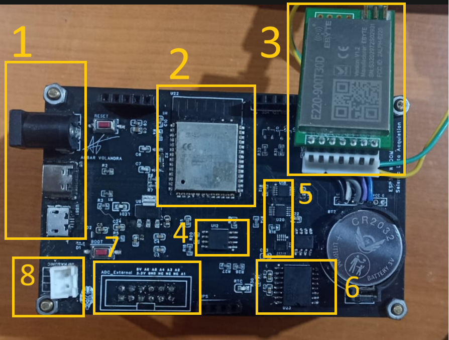
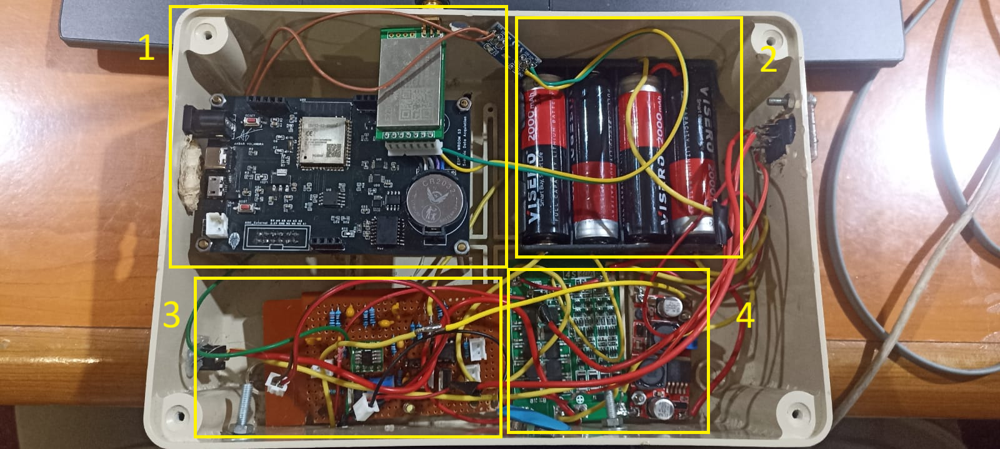
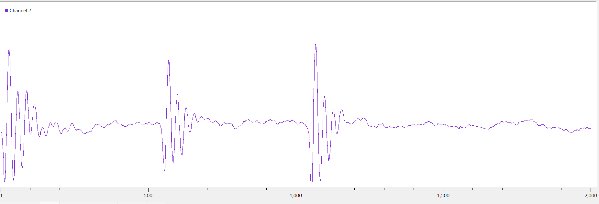

# 🌋 ESP32-S3 3C Seismic Data Acquisition System with LoRa & High-Speed SPI Flash Data Logger

[](https://opensource.org/licenses/MIT)
[](https://www.espressif.com/)
[-green)](https://www.ti.com/)
[](https://www.ebyte.com/)
[](https://www.arduino.cc/)

> **Undergraduate Thesis Project / Skripsi (2026)**  
> **Judul:** *Pengembangan Sistem Akuisisi Data Seismik (3C) Berbasis ESP32 dengan Fasilitas Komunikasi Data LoRa*  
> **Penulis:** Sultan Arief Akbar Volandra (NIM: 225090800111002)  
> **Instansi:** Program Studi S1 Instrumentasi, Departemen Fisika, FMIPA, Universitas Brawijaya, Malang  

---

## 📌 Ringkasan Proyek

Proyek ini merealisasikan **Sistem Akuisisi Data Seismik 3-Komponen (3C: Sumbu X, Y, Z)** yang portabel, ekonomis, dan berpresisi tinggi untuk perekaman sinyal seismik / getaran tanah frekuensi rendah (1 Hz – 100 Hz).

Sistem dirancang menggunakan **ESP32-S3 WROOM**, tiga buah **ADC 16-bit ADS1115** terpisah (jalur I2C 1 MHz), **LoRa Transceiver E220-900T22D** (komunikasi nirkabel jarak jauh), serta **Serial SPI Flash Memory Winbond W25Q128JV (16 MB)** untuk *high-speed local binary data logging*.

```
 +-------------------------------------------------------------------------+
 |                         NODE SENSOR (TRANSMITTER)                       |
 |                                                                         |
 |  [Sensor 3C / MMA7361] ---> [ 3x External ADS1115 (16-Bit) ]            |
 |                                    | (I2C Bus @ 1 MHz)                  |
 |                                    v                                    |
 |                             [ ESP32-S3 Dual-Core ]                      |
 |                                 /          \                            |
 |            (Core 1: DAQ & Log) /            \ (Core 0: Wireless TX)     |
 |                               v              v                          |
 |            [ 16MB SPI Flash W25Q128 ]    [ LoRa E220-900T22D ]         |
 +----------------------------------------------------|--------------------+
                                                      |
                                               ((( 868-915 MHz ))) [LoRa Link]
                                                      |
 +----------------------------------------------------v--------------------+
 |                            GATEWAY (RECEIVER)                           |
 |                                                                         |
 |                      [ LoRa E220-900T22D Transceiver ]                  |
 |                                    | (UART @ 115200 bps)                |
 |                                    v                                    |
 |                      [ Raspberry Pi Pico (RP2040) ]                     |
 |                                    | (USB CDC Serial)                   |
 |                                    v                                    |
 |                  [ Laptop / PC (SerialPlot & CoolTerm) ]                |
 +-------------------------------------------------------------------------+
```

---

## 📸 Dokumentasi Perangkat Keras & Visualisasi


|<br>**1. Board Utama DAQ PCB (SMD)** | <br>**2. Integrasi Keseluruhan Sistem & Box Enclosure** |
|:---:|:---:|
|<br>**3. Gateway Receiver (RP2040 + LoRa)** | <br>**4. Perekaman Sinyal Real-time (SerialPlot)** |

---

## ✨ Fitur-Fitur Utama

- **Akuisisi Simulta 3 Kanal (3C):** Merekam komponen sumbu X, Y, dan Z secara independen tanpa inter-channel delay.
- **Resolusi Tinggi 16-Bit:** Memanfaatkan 3 unit ADC eksternal ADS1115 dengan *Programmable Gain Amplifier* (PGA).
- **Kecepatan Sampling Tinggi & Presisi:**
  - **833 SPS** pada mode Direct Serial Transmission.
  - **857 SPS** pada mode Logging Biner SPI Flash (Error hanya **0.35%** dibanding batas teori 860 SPS).
- **FreeRTOS Dual-Core Architecture (ESP32-S3):**
  - **Core 1:** Bertanggung jawab penuh untuk pembacaan I2C ADC, *timestamping* presisi mikrodetik, dan penulisan biner ke SPI Flash.
  - **Core 0:** Khusus menangani enkapsulasi data dan transmisi nirkabel LoRa.
- **High-Speed Data Logging Biner (SPI Flash 16 MB):** Perekaman berbasis biner terstruktur + *CRC Checksum* untuk mencegah *overhead* pemrosesan teks ASCII.
- **Komunikasi Nirkabel LoRa:** Integrasi modul Ebyte E220-900T22D (+30 dBm / 1 Watt Output Power).
- **Embedded RTC & Battery Management System:** Terintegrasi RTC DS3231, sistem daya baterai Li-Ion 4S (16.8V Max) dengan BMS, serta modul regulator step-down 12V/5V/3.3V.

---

## 🛠️ Spesifikasi Perangkat Keras

### 1. Transmitter Board (Node Sensor)
* **Mikrokontroler Utama:** ESP32-S3 WROOM-1 (Dual-Core Xtensa LX7 @ 240 MHz, 512 KB SRAM)
* **ADC Eksternal:** 3x Texas Instruments ADS1115 (16-Bit Delta-Sigma ADC, Alamat I2C: `0x48`, `0x49`, `0x4A`)
* **Memori Penyimpanan:** Winbond W25Q128JV (128 Mbit / 16 MB NOR Flash via SPI)
* **Real-Time Clock:** Maxim DS3231 High-Precision RTC (`0x68`)
* **Modul Nirkabel:** Ebyte E220-900T22D (LoRa UART Transceiver, 850.125 – 930.125 MHz)
* **Dukungan Sensor:** Accelerometer MMA7361, Geophone Velocity Sensor, & Filter Infrasonik
* **Catu Daya:** Baterai Li-Ion 4S (16.8V Max), BMS 4S, Regulator AMS1117-3.3V, & Buck Converter 12V/5V

### 2. Receiver Board (Gateway)
* **Mikrokontroler:** Raspberry Pi Pico (RP2040 Dual-Core ARM Cortex-M0+)
* **Modul Nirkabel:** Ebyte E220-900T22D
* **Power Supply:** External LDO AMS1117-3.3V Regulator

---

## 📊 Hasil Pengujian & Uji Performa

### 1. Perbandingan Kecepatan Sampling (Sampling Rate)

| Mode Operasi | Target Teori (Datasheet) | Hasil Aktual (SPS) | Percentage Error |
|---|:---:|:---:|:---:|
| **SPI Flash Memory Logging (Binary)** | 860 SPS | **857 SPS** | **0.35 %** |
| **Direct Serial Monitor (ASCII Text)** | 860 SPS | **833 SPS** | **3.14 %** |

### 2. Respon Frekuensi Sinyal Seismik

| Rentang Frekuensi Input | Respon Perekaman & Form Sinyal |
|:---:|---|
| **1 Hz – 50 Hz** | Sinyal sinusoidal terekam sangat stabil tanpa distorsi (Sesuai target sinyal seismik). |
| **100 Hz** | Gelombang masih terakuisisi dan tervisualisasi dengan baik. |
| **200 Hz** | Terjadi distorsi dan aliasing (Mencapai batas Nyquist sampling). |

---

## 🔌 Konfigurasi Pin & Alamat I2C

### Alamat I2C (Transmitter)
* **ADC 1 (Sumbu X):** `0x48` (Pin ADDR -> GND)
* **ADC 2 (Sumbu Y):** `0x49` (Pin ADDR -> VCC)
* **ADC 3 (Sumbu Z):** `0x4A` (Pin ADDR -> SDA)
* **RTC DS3231:** `0x68`
* **EEPROM AT24C32:** `0x50`

### Koneksi SPI Flash W25Q128JV (Transmitter)
* `CS` $
ightarrow$ GPIO 10
* `MISO (DO)` $
ightarrow$ GPIO 11
* `SCK` $
ightarrow$ GPIO 12
* `MOSI (DI)` $
ightarrow$ GPIO 13

---

## 📁 Struktur Folder Repositori

```
.
├── firmware/
│   ├── transmitter_esp32/
│   │   └── transmitter_esp32.ino    # Firmware utama ESP32-S3 (Dual-Core FreeRTOS)
│   └── receiver_rp2040/
│       └── receiver_rp2040.ino      # Firmware gateway receiver (RP2040)
├── hardware/
│   ├── schematics/                  # Skematik rangkaian (PDF / EasyEDA)
│   └── pcb_layout/                  # File Gerber & Layout PCB
├── docs/
│   ├── images/                      # Foto alat & grafik hasil pengujian
│   └── thesis_summary.pdf           # Naskah / Rangkuman Skripsi
├── README.md
└── LICENSE
```

---

## 💻 Panduan Penggunaan & Pengoperasian

### 1. Persiapan Software
1. Install [Arduino IDE](https://www.arduino.cc/en/software).
2. Tambahkan Package Board Manager untuk **ESP32** dan **Raspberry Pi Pico (RP2040)**.

### 2. Upload Firmware
1. Buka `firmware/transmitter_esp32/transmitter_esp32.ino` lalu upload ke board **ESP32-S3**.
2. Buka `firmware/receiver_rp2040/receiver_rp2040.ino` lalu upload ke board **Raspberry Pi Pico**.

### 3. Kontrol Perintah via Serial Terminal (CoolTerm / SerialPlot)
Hubungkan ESP32-S3 ke PC via USB Serial (Baud Rate: `115200`), lalu ketik perintah berikut:
* `R` : Memulai perekaman data seismik (*Data Logging* ke SPI Flash).
* `D` : Menampilkan/ekstrak (*Dump*) seluruh data dari Flash Memory ke format CSV.
* `C` : Format/Menghapus seluruh isi chip SPI Flash (*Clear Memory*).

---

## 👨‍💻 Penulis

**Sultan Arief Akbar Volandra**  
* **Program Studi:** S1 Instrumentasi, Departemen Fisika  
* **Fakultas:** Matematika dan Ilmu Pengetahuan Alam (FMIPA)  
* **Universitas:** Universitas Brawijaya, Malang  
* **Email:** [sultanvolandra@gmail.com](mailto:sultanvolandra@gmail.com)  

---

## 📜 Lisensi

Proyek ini dirilis di bawah lisensi **MIT License** - Bebas digunakan dan dikembangkan kembali untuk keperluan akademis maupun komersial dengan mencantumkan atribusi penulis.
